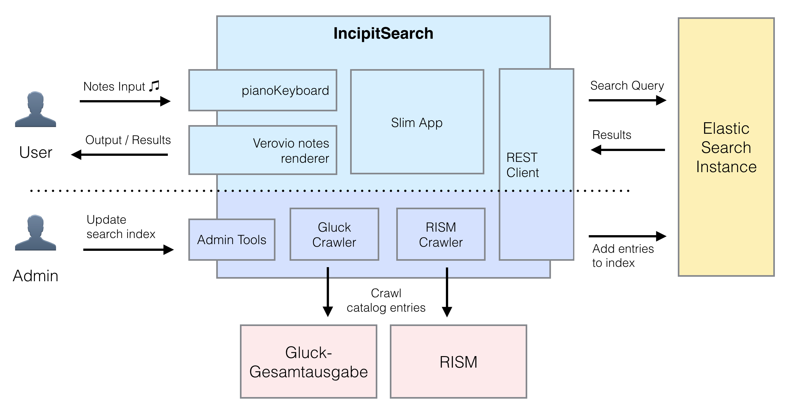

# IncipitSearch
A crawler and search interface for musical incipits.

This project was developed to index the incipits of the Gluck-Gesamtausgabe catalog. It crawls the catalog for incipits, processes the entries and indexes them using an Elastic Search Instance. The IncipitSearch provide a convenient search interface to search the incipits for melodies.

Even though it was developed to be used on the Gluck-Gesamtausgabe it is build very modularly and can easily be adjusted to crawl and index any other musical catalog for incipits.


# Dependecies
To make use of the IncipitSearch you need two things:
* An [Elastic Search](https://www.elastic.co) instance
* A catalog of musical incipits with a public interface

The IncipitSearch web-interface uses the virtual keyboard  of the [pianoKeyboard project](https://github.com/annaneo/pianoKeyboard), which is directly integrated in the code.

To display notes on the website, IncipitSearch makes use of the  [Verovio Toolkit](http://www.verovio.org/download.xhtml)


# Usage

## Structure



## Requirements
The search web-interface works on any recent browser (for Internet Explorer version 10 is required).

This project requires PHP 7 and complies with [PSR-1, PSR-2  (code style) and PSR-4 (autoloading)](http://www.php-fig.org/)

We use [Composer as a package manager](https://getcomposer.org). Among others, we depend on the following packages:

* [Slim Framework](http://www.slimframework.com/docs/) for Routing as minimal web framework
* [Twig](http://twig.sensiolabs.org/) as Templating Engine with [Slim-Twig-Views](http://www.slimframework.com/docs/features/templates.html#the-slimtwig-view-component) 
* [Elastic Search PHP Client](https://www.elastic.co/guide/en/elasticsearch/client/php-api/2.0/index.html) to access the Elastic Search instance more conveneiently

For the complete list of used frameworks see the `composer.json` file

**Important:**

**After pulling the repositories you need to load all required php packages using composer with
`composer update`**

## Configuration

You can setup the configuration in the `config.json file. It looks like this:

```JSON
{
    "elasticSearch": {
        "host": "http://10.0.0.1"
    },
    "security": {
    "enableBrowserIndexManagement": true,
    "adminPassword": "super-secret-password"
    }
}
```

In the `elasticSearch` field enter the address of your Elastic Search instance.

The `adminPassword` is for the index management pages. If you don't want to use the browser based index  management (see below), just set  `enableBrowserIndexManagement` to `false`


### Layout and Styling
The web interface is based on [Skeleton](http://getskeleton.com). You can easily overwrite any style in the `styles.css` file.


## Basic Use

### Running the search interface
During development can run the the web-interface using the webserver built into PHP 7:
```
php -S localhost:8000
```


### Managing the Index
There are two built in ways to reset and create the Elastic Search Index:

#### Web Interface
You can reset the index and start the crawler for re-indexing using the graphical web interface at 

```
http://localhost/crawler
```
The web interface must be enabled in the `config.json` file and requires a password, which is also set in the `config.json` (see above).


#### Command Line Interface
The `command_line_scripts` folder contains two scripts that can be called directly from the command line.

The scripts must be called from the same working directory as `index.php`.
Otherwise the paths for config and autoload will not match and you get an ugly error.

For example: If `index.php` lies on the root directory call the script from the root directory with 

```
php command_line_scripts/scriptname.php
```

If `index.php` lies in public call the scripts like this:

```
cd public
php ../command_line_scripts/scriptname.php
```


## Incipit Representation
We use the Plaine & Easie Code (PAE) to store the incipits.
The entire format is documented on the PAE-project site: 
http://www.iaml.info/plaine-easie-code

### Incipit data structure
To be easily usable with the Verovio-Tookit and be more flexible in search requests the Incipit data structure is more fine grained than just the Plaine & Easie code.

```PHP
protected $clef;
protected $accidentals;
protected $time;
protected $notes;
```


### Incipit normalization
Musical notation is ambiguous. When searching for Incipits the user might not know the exact notation.

Our users are expected to use a virtual keyboard to search for incipits. In that case, the user will just hit certain keyboard-keys and has no option (or intention) to enter rhythmic values, key signature or clef.

To be able to search for simplified input (like notes without rhythmic value) we need to normalize the incipits and remove unnecessary information.

As search does a string comparison, it is necessary to bring ambiguous PAE-Codes to a normalized form.
We do that by expanding all abbreviations and removing all rhythmic values.

The Incipit model provides two computed properties for normalized versions of the incipit:

`getNotesNormalizedToSingleOctave`

Returns the notes on a single octave only.
For 
`''4D8AA4D-/DxFAF/` with signature accidental bD 
this returns 
`bDAAbDbDxFAxF`
(all D become bD and in the second measure all F become xF)

`getNotesNormalizedToPitch`

Returns the only the pitched notes.
For 
`''4D8AA4D-/DxFAF/` with signature accidental bD 
this returns 
`''bD''A''A''bD''bD''xF''A''xF`


## Known Issues
The IncipitSearch website does not render well on small screens.


# License and Contribution
IncipitSearch was developed by Anna Neovesky and 
Gabriel Reimers at the [Digital Academy](https://www.digitale-akademie.de) of the [Academy of Sciences and Literatur | Mainz](https://www.adwmainz.de)
 
This framework is license under MIT License.
Any contributions in form of bug reports or pull requests are welcome.

The [Verovio Framework](https://github.com/rism-ch/verovio) is developed by the [Swiss RISM Office](http://rism-ch.org/), licensed under LGPL and is not affiliated with this project.


